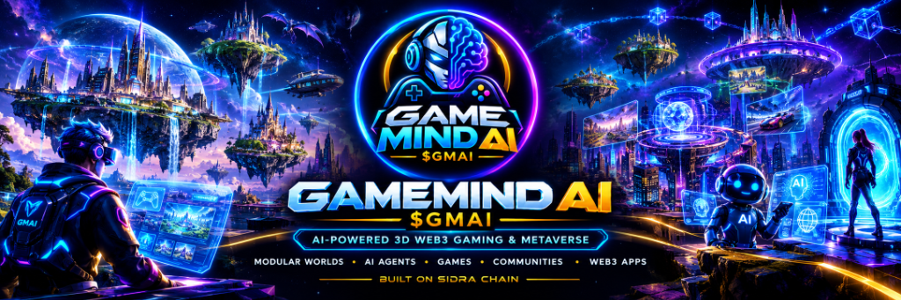
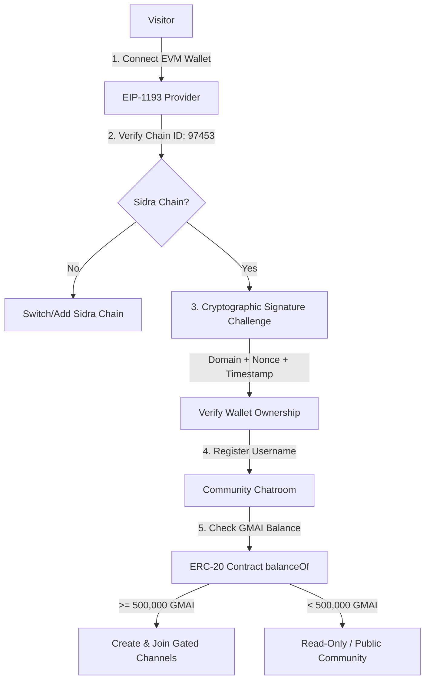

# GameMind AI ($GMAI) — Wallet-Connected Token-Gated Chatroom dApp



Official real-time decentralized chatroom platform for the **GameMind AI ($GMAI)** gaming and metaverse ecosystem on **Sidra Chain**.

---

## 🌟 Overview & Architecture

The **GameMind AI Chatroom dApp** combines Web3 wallet authentication, on-chain token verification, and peer-to-peer real-time state synchronization via **GUN.js**:

* **Official Branding & Identity**: Built using the official circular GameMind AI Cyborg-Brain logo and 3D cyber metaverse visual assets.
* **Network**: Built natively for **Sidra Chain** (Chain ID: `97453`).
* **Token Access Control**: Verified reads directly from the official **GameMind AI ($GMAI)** token contract (`0x4765561e63914E72168bBd2A7e2ce72F9057ca04`).
* **Real-time Messaging**: Decentralized graph architecture powered by **GUN.js** with local persistence and relay capabilities.



---

## ⚙️ Blockchain Configuration

All blockchain parameters are centralized and configurable in [`src/config/blockchain.ts`](src/config/blockchain.ts) and `.env`:

| Parameter | Value | Description |
| :--- | :--- | :--- |
| **Network** | Sidra Chain | EVM-compatible layer |
| **Chain ID** | `97453` (`0x17cb5`) | Required network ID |
| **RPC Endpoint** | `https://node.sidrachain.com` | Configurable in `.env` |
| **Explorer** | `https://explorer.sidrachain.com` | Block & token explorer |
| **Native Currency** | SIDRA (18 decimals) | Gas currency |
| **$GMAI Token Address** | `0x4765561e63914E72168bBd2A7e2ce72F9057ca04` | ERC-20 token contract |
| **Min Balance to Create Room** | `500,000 GMAI` | Gate for room creation |
| **Default Gated Access** | `500,000 GMAI` | Configurable per gated room |

---

## 🚀 Features

### 1. Web3 Wallet Connection & Network Switching
* Seamlessly connects to **PinetSwap** (Sidra native wallet & DEX), **SafePal**, MetaMask, OKX, Rabby, Coinbase, and standard EIP-1193 EVM wallets.
* Mobile-responsive wallet modal with deep-linking for mobile browsers, external explorer clipboard helpers, and direct in-app webview auto-detection.
* Automatically prompts users to add or switch to **Sidra Chain (97453)** if connected to another network.
* Supports clean session teardown and wallet disconnect.

### 2. Cryptographic Authentication & Username Registration
* **Zero Gas & Zero Cost**: No transaction required to log in.
* Domain-bound authentication challenge containing unique random nonces and timestamp prevents signature replay attacks.
* Unique username registration associated with the verified wallet address.
* Immediate, non-blocking default session (`@Player_xxxx`) upon connection with 1-tap handle customization.
* Anti-impersonation protection preventing other wallets from claiming an existing user's handle.

### 3. Mobile Fast-Switch Channels & Responsive Experience
* **1-Touch Mobile Channel Bar**: Horizontal scrolling channel switcher on mobile (`#community-general`, `#ai-agents`, `#metaverse-gaming`, `#gmai-vip-lounge`, and holder rooms).
* **Modal-Free Entry**: Instant access to the dashboard upon wallet connection without trapping overlays.
* **Persistent Identity Strip**: Shows current chatting handle and wallet address above input with instant edit capability.

### 4. Token-Gated Room Creation (500,000 $GMAI Minimum)
* Real-time read of user's balance from the token contract (`balanceOf(address)` and `decimals()`).
* Accounts strictly for the contract's actual 18 decimals; balances supplied by the client are never trusted.
* Users with < 500,000 $GMAI receive an informative lock banner indicating their current balance and shortfall.
* Users with >= 500,000 $GMAI unlock full room creation with custom slugs, categories, descriptions, rules, and privacy controls.

### 5. Real-Time Chat & GUN.js Synchronization
* Instant message delivery across peer nodes without manual refreshes.
* Emoji reaction bar (`👍`, `🚀`, `🎮`, `🔥`, `💎`, `❤️`) with interactive counters.
* Unread message indicators for background rooms.
* User presence tracking (`online`, `offline`) via Gun graph nodes.
* Room creator moderation tools: pin key announcements, delete/hide messages.
* Client-side mute/block list to filter abusive peers.

### 6. Security & Anti-Spam
* Message rate limiting with interactive cooldown timers.
* Input sanitization escaping script tags and potential XSS vectors.
* Message length capped at 500 characters.
* Fail-closed architecture on network errors when evaluating token-gated rooms.

---

## 🛠️ Installation & Quickstart

### Prerequisites
* **Node.js**: v18.0.0 or higher (v24+ recommended)
* **npm**: v9.0.0 or higher

### 1. Clone & Install Dependencies
```bash
git clone <repository-url>
cd GMAI-chatroom
npm install
```

### 2. Configure Environment
Copy `.env.example` to `.env`:
```bash
cp .env.example .env
```

### 3. Run Development Server
```bash
npm run dev
```
The application will be accessible at: `http://localhost:5173/`

### 4. Run Gun.js Relay Server (Optional)
```bash
npm start
```
Starts the Express relay server on port `8000` with Radisk persistence at `http://localhost:8000/gun`.

---

## 🧪 Automated Testing

### 1. Vitest Unit & Integration Suite
Run the automated Vitest test suite to verify token gating, cryptographic signatures, and anti-spam sanitization:

```bash
npm test
```

* `tests/auth.test.ts`: Cryptographic challenge creation, wallet signature verification, username formatting, and anti-impersonation.
* `tests/tokenGating.test.ts`: 500,000 $GMAI creation threshold, decimal parsing, and fail-closed room entry logic.
* `tests/chatSecurity.test.ts`: XSS prevention, message length enforcement, and room slug validation.
* `tests/walletProvider.test.ts`: SafePal, PinetSwap, and multi-wallet EIP-1193 detection and mobile in-app fallback.

### 2. TesterArmy Agentic E2E Framework
Run end-to-end responsive UI tests using [`tester-army/e2e`](https://github.com/tester-army/e2e):

```bash
npm run test:e2e
```

* `tests/mobile.e2e.ts`: Mobile viewport (390x844) responsive layout, header visibility, 1-touch channel switching bar, and modal-free message composition.

---

## 📦 Production Build & Deployment

To compile the production frontend:
```bash
npm run build
```
The optimized bundle will be generated in `dist/`.

### Deployment Options:
1. **Full-stack (Vercel / Node Server)**:
   Deploy the repository with `npm start` to run the Express Gun relay and serve static files.
2. **Static Web3 Hosting (IPFS / Fleek / Netlify / Cloudflare Pages)**:
   Deploy the `dist/` directory directly. The app will communicate via public Gun relays (`https://gun-manhattan.herokuapp.com/gun`).

---

## 🔒 Security Assumptions & Limitations

* **GUN.js Persistence**: GUN is an open distributed graph. Public channels are accessible to peers on the network. Do not paste private keys, seed phrases, or sensitive personal data into chat messages.
* **Token Ownership**: Balances are verified against the Sidra Chain node RPC. In the event of an RPC outage, token-gated rooms fail closed.
* **Zero Funds Custody**: This dApp never requests transfers, approval allowances, or burns of $GMAI tokens.

---

## 📜 License
MIT License. GameMind AI ($GMAI) Ecosystem.
